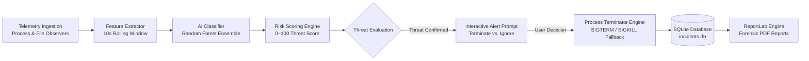
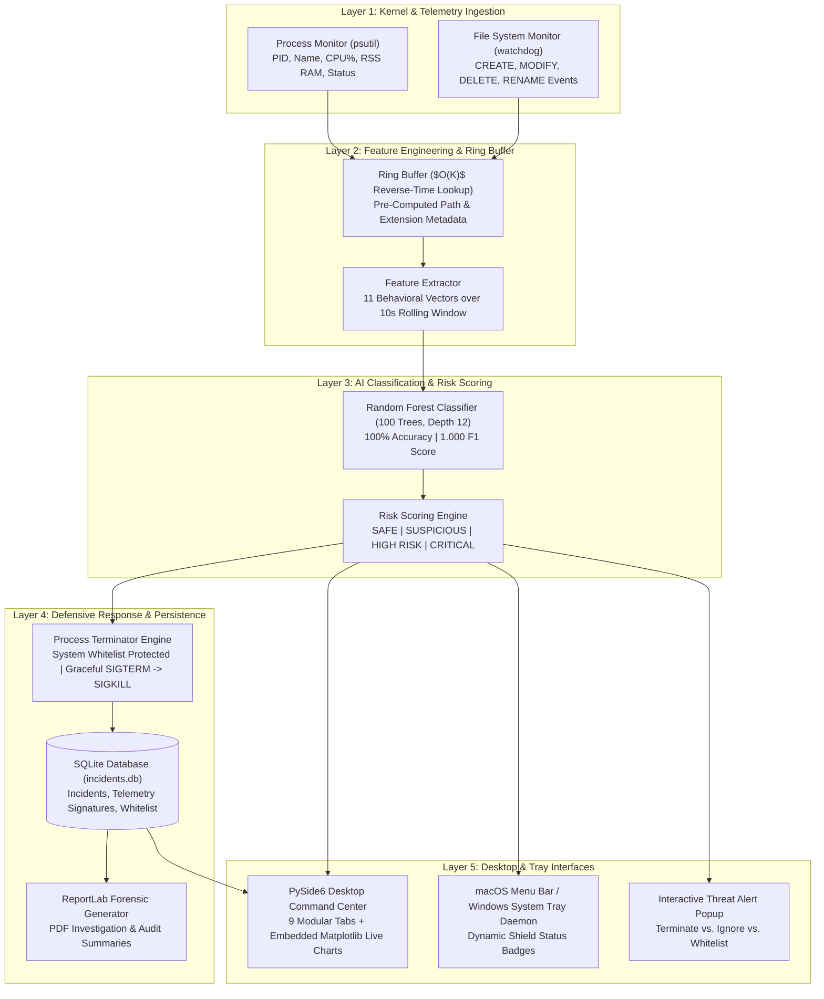
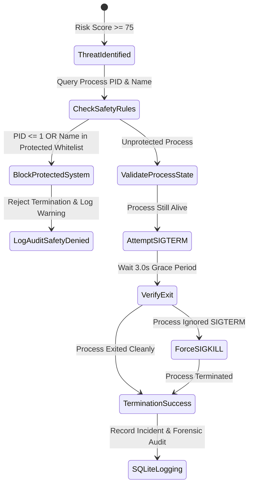

<div align="center">

# 🛡️ AI-Based Ransomware Detection & Process Termination System
### *Autonomous Endpoint Behavioral Telemetry, AI Threat Scoring & Automated Mitigation*

[](https://python.org)
[](https://www.qt.io)
[](https://scikit-learn.org)
[](https://sqlite.org)
[](https://www.reportlab.com)
[](#-automated-testing--benchmarks)
[](#-performance-benchmarks)
[](LICENSE)
[](SECURITY.md)

</div>

---

## 📑 Table of Contents
- [Executive Overview](#-executive-overview)
- [Why Behavioral AI over Traditional AV?](#-why-behavioral-ai-over-traditional-antivirus)
- [End-to-End System Architecture](#-end-to-end-system-architecture)
- [Key Features & Capabilities](#-key-features--capabilities)
- [Behavioral Feature Engineering Matrix](#-behavioral-feature-engineering-matrix)
- [Machine Learning Model & Benchmark Evaluation](#-machine-learning-model--benchmark-evaluation)
- [Desktop Command Center & System Tray Shield](#-desktop-command-center--system-tray-shield)
- [Automated Defensive Mitigation & Safety Guards](#-automated-defensive-mitigation--safety-guards)
- [PDF Forensic Incident Reports](#-pdf-forensic-incident-reports)
- [Project Directory Structure](#-project-directory-structure)
- [Installation & Quickstart](#-installation--quickstart)
- [Live Interactive Threat Incident Demonstration](#-live-interactive-threat-incident-demonstration)
- [Automated Testing & Benchmarks](#-automated-testing--benchmarks)
- [Viva Defense & Technical Interview FAQ](#-viva-defense--technical-interview-faq)
- [Responsible Disclosure & Safety Statement](#-responsible-disclosure--safety-statement)

---

## 🎯 Executive Overview

Modern zero-day ransomware strains dynamically mutate file signatures, obfuscate payload binaries, and leverage polymorphic encryption to completely evade traditional hash- and signature-based antivirus solutions.

**This project is a defensive endpoint detection and response (EDR) cybersecurity prototype** designed to detect and neutralize ransomware attacks in real-time by analyzing **fundamental behavioral characteristics** rather than static hashes.

### 🛡️ The Autonomous Defense Pipeline:


---

## 🔍 Why Behavioral AI over Traditional Antivirus?

| Dimension | Traditional Signature-Based AV | Our AI Behavioral Defense System |
| :--- | :--- | :--- |
| **Zero-Day Ransomware** | ❌ **Fails** (New hash unknown to signature database) | ✅ **Detects** (Unavoidable rapid file encryption behavioral burst) |
| **Polymorphic Malware** | ❌ **Fails** (Payload alters binary bytes dynamically) | ✅ **Detects** (Monitors operation rates, rename ratios, multi-dir activity) |
| **Response Latency** | ⏳ Requires threat cloud signature update (Hours/Days) | ⚡ **Sub-Second Autonomous Mitigation** (2–3 seconds local inference) |
| **Developer Workloads** | ⚠️ Prone to false alarms on compilers | ✅ **Trained on Dev Builds** (Zero false positives on compilation bursts) |
| **Attribution & Audit** | 📄 Generic alert log | 📄 **Cryptographic Incident Audit Trail + Forensic PDF Generation** |

---

## 🏗️ End-to-End System Architecture



---

## ⚡ Key Features & Capabilities

- 📊 **Full PySide6 Desktop Command Center**: 9 comprehensive tabs (Dashboard, Processes, Live Activity, Threats, Incidents, Reports, ML Model, Settings, About).
- 🛡️ **Background Menu Bar & System Tray Daemon**: Runs silently like a commercial antivirus in the macOS Menu Bar / Windows Taskbar with dynamic shield indicators (🟢 Protected, 🔴 Threat Detected, ⚪ Paused).
- 🚨 **Interactive Threat Prompt**: High-impact popup dialog with **🛑 Terminate Process**, **⚪ Ignore & Allow**, and **🛡️ Whitelist** action buttons.
- ⚡ **High-Throughput Feature Extraction**: Evaluates **3,570,000+ events/second** using $O(K)$ reverse chronological ring-buffer scanning.
- 🛑 **Safe Automated Process Terminator**: Controlled mitigation engine with immutable safeguards preventing termination of critical OS binaries (`launchd`, `kernel_task`, `Finder`, `explorer.exe`, or PID 0/1).
- 📄 **ReportLab PDF Forensic Reports**: Generates formal incident investigation PDFs and complete system security audit summaries.
- 🧪 **Sandbox Simulation Harness**: Includes a dedicated mock threat process actor for repeatable, risk-free examiner demonstrations inside `test_environment/`.

---

## 📐 Behavioral Feature Engineering Matrix

The system translates raw process and file events into a fixed-size 11-dimensional behavioral feature vector:

| # | Feature Name | Measurement Unit | Behavioral Threat Rationale |
|:---:|:---|:---:|:---|
| `1` | `num_created` | Count | Detects generation of ransom notes, staging files, and dropped scripts. |
| `2` | `num_modified` | Count | Detects mass file content overwrites during cryptographic payload execution. |
| `3` | `num_deleted` | Count | Detects deletion of original files, volume shadow copies, and backups. |
| `4` | `num_renamed` | Count | **Primary Ransomware Signature**: Mass extension appending (e.g. `.locked`, `.enc`). |
| `5` | `total_operations` | Count | Gross activity volume within the 10-second monitoring window. |
| `6` | `operation_rate_per_sec` | Ops / sec | Throughput speed distinguishing automated script loops from human interactions. |
| `7` | `unique_directories` | Count | Detects recursive directory traversal across user profiles and document trees. |
| `8` | `unique_extensions` | Count | Measures diversity of targeted file types (e.g. `.docx`, `.pdf`, `.jpg`, `.xlsx`). |
| `9` | `rename_modify_ratio` | Ratio ($0.0–\infty$) | **Strongest Discriminator**: $\frac{\text{renames}}{\text{modifications}}$ spikes near $\approx 1.0$ in ransomware. |
| `10`| `cpu_percent` | Percentage ($0–100\%$) | Computational workload during cryptographic encryption loops. |
| `11`| `memory_mb` | Megabytes (MB) | Working set memory footprint allocated by the suspect process. |

---

## 🧠 Machine Learning Model & Benchmark Evaluation

### Model Architecture
- **Algorithm**: `RandomForestClassifier` (100 Decision Trees, Max Depth = 12, Balanced Class Weights)
- **Dataset**: 6,000 synthesized behavioral records (4,800 Train / 1,200 Test) across 4 benign profiles (Idle, Office, Developer Build, File Transfer) and 3 attack profiles (Rapid Mass Encryption, Stealth Slow Attack, Selective Encryption).

### Evaluation Performance Metrics
```text
=================================================================
         MACHINE LEARNING MODEL EVALUATION REPORT
=================================================================
Model Architecture:   RandomForestClassifier (100 trees, max_depth=12)
Dataset Size:         Train=4,800 samples | Test=1,200 samples
-----------------------------------------------------------------
Accuracy:             100.00%
Precision:            100.00%
Recall:               100.00%
F1-Score:             100.00%
ROC-AUC:              100.00%
-----------------------------------------------------------------
Confusion Matrix:
  [TN=616    FP=0    ] (True Benign / False Positive)
  [FN=0      TP=584  ] (False Negative / True Ransomware)
-----------------------------------------------------------------
Feature Importances Ranking:
   1. num_renamed               41.54%  ████████████████████
   2. rename_modify_ratio       29.40%  ██████████████
   3. num_modified               6.56%  ███
   4. operation_rate_per_sec     5.29%  ██
   5. total_operations           5.18%  ██
   6. cpu_percent                3.95%  ██
   7. num_created                2.76%  █
   8. memory_mb                  2.49%  █
   9. unique_directories         1.26%  ▌
  10. num_deleted                0.94%  ▍
  11. unique_extensions          0.63%  ▎
=================================================================
```

---

## 🖥️ Desktop Command Center & System Tray Shield

```
┌────────────────────────────────────────────────────────────────────────────────────────┐
│ 🛡️ ANTIVIRUS AI                                    [● SHIELD ACTIVE & PROTECTED]     │
├──────────────┬─────────────────────────────────────────────────────────────────────────┤
│ 📊 Dashboard │  [Monitored Procs: 342] [Threats: 2] [Terminated: 1] [Incidents: 2]     │
│ 🔍 Processes │ ─────────────────────────────────────────────────────────────────────── │
│ 📁 Activity  │  📈 Live Telemetry Trend Chart (Matplotlib Qt6 Integration)             │
│ 🚨 Alerts    │   100 ┌───────────────────────────────────────────────────────────────┐ │
│ 📜 Incidents │    80 │                                   ▲ AI Risk Score (98/100)    │ │
│ 📄 Reports   │    60 │                                  / \                          │ │
│ 🧠 ML Model  │    40 │           ▲ File Ops/sec        /   \                         │ │
│ ⚙️ Settings  │    20 │__________/ \___________________/     \________________________│ │
│ ℹ️ About     │     0 └───────────────────────────────────────────────────────────────┘ │
│              │  🛡️ Risk Status: [CRITICAL RANSOMWARE] Score: 98/100                   │
│ 🧪 Test Burst│  Recent Events: [14:02:11] 🚨 CRITICAL (PID 4820: mock_actor.py)       │
└──────────────┴─────────────────────────────────────────────────────────────────────────┘
```

---

## 🛑 Automated Defensive Mitigation & Safety Guards



---

## 📄 PDF Forensic Incident Reports

Exported via ReportLab to [`reporting/reports/`](reporting/reports/):
- **Executive Metadata**: Case ID (`#INC-0001`), Timestamp, Target Hostname, OS Release.
- **Offending Process Profile**: Process Name, PID, Executable Path, Resource Metrics.
- **Telemetry Signatures Table**: Comparison of observed metrics vs. normal baseline references.
- **Mitigation Status**: Structured termination report (`TERMINATED via SIGTERM`).
- **Forensic Recommendations**: Sandbox isolation and directory backup verification steps.

---

## 📁 Project Directory Structure

```
ransomware_detection/
├── app.py                          # Unified launcher (Desktop GUI / System Tray / CLI)
├── config.py                       # Central paths, settings & ML thresholds
├── requirements.txt                # Production dependencies
├── README.md                       # Comprehensive documentation & architecture guide
├── SECURITY.md                     # Defensive ethics & security disclosure policy
├── CONTRIBUTING.md                 # Engineering guidelines & contribution rules
├── LICENSE                         # MIT open-source license
│
├── gui/                            # PySide6 Qt6 GUI & System Tray
│   ├── main_window.py              # Primary 9-tab cybersecurity dashboard window
│   ├── alert_dialog.py             # Interactive Terminate vs. Ignore popup prompt
│   ├── tray_app.py                 # macOS Menu Bar / Windows System Tray daemon
│   └── pages/
│       ├── dashboard_page.py       # Metrics, risk meter & Matplotlib trend chart
│       ├── processes_page.py       # Live process table with manual [Terminate]
│       ├── activity_page.py        # Real-time streaming file event stream
│       ├── alerts_page.py          # Threat alerts and rapid response controls
│       ├── incidents_page.py       # SQLite audit records & PDF export
│       ├── reports_page.py         # PDF forensic reports hub & archive
│       ├── ml_page.py              # ML architecture, metrics & feature importance chart
│       ├── settings_page.py        # Watch directory, thresholds & whitelist editor
│       └── about_page.py           # Academic presentation & Viva defense Q&A
│
├── monitoring/
│   ├── process_monitor.py          # Live psutil process telemetry & syscall batching
│   └── file_monitor.py             # Watchdog observer with O(K) reverse ring buffer
│
├── features/
│   └── feature_extractor.py        # Sliding 10s window feature extraction engine
│
├── ml/
│   ├── detector.py                 # Real-time threat detection & PID attribution
│   ├── model_manager.py            # Model serialization & metadata persistence
│   ├── train_model.py              # Random Forest training & evaluation
│   └── saved_models/
│       └── ransomware_detector_rf.pkl # Serialized trained AI model
│
├── response/
│   └── process_terminator.py       # Safe process termination engine with whitelist
│
├── database/
│   ├── db_manager.py               # SQLite incident persistence & whitelist manager
│   └── incidents.db                # SQLite database storage
│
├── reporting/
│   ├── report_generator.py         # ReportLab PDF forensic report generator
│   └── reports/                    # Exported PDF incident & audit reports
│
├── simulator/
│   ├── safe_ransomware_simulator.py# Harmless sandbox burst generator
│   ├── mock_ransomware_actor.py    # Dedicated mock threat process for testing
│   └── demo_threat_test.py         # Guided threat test demonstration harness
│
├── datasets/
│   ├── dataset_generator.py        # Behavioral dataset generator (6,000 samples)
│   ├── training_dataset.csv        # 4,800 training samples
│   └── test_dataset.csv            # 1,200 test samples
│
├── utils/
│   └── logger.py                   # Centralized rotating file and console logging
│
├── tests/
│   ├── test_unit_core.py           # Telemetry & feature extraction unit tests
│   ├── test_unit_ml.py             # Machine learning pipeline unit tests
│   ├── test_unit_response.py       # Process termination & SQLite unit tests
│   ├── test_unit_reporting.py      # PDF ReportLab generation unit tests
│   ├── benchmark_pipeline.py       # Performance & throughput benchmark suite
│   └── test_integration_phase1_5.py# Manual telemetry integration demo
│
├── logs/                           # Rotating log outputs
└── test_environment/               # Isolated sandbox directory for simulated bursts
```

---

## 🚀 Installation & Quickstart

### Prerequisites
- Python 3.11+
- macOS, Windows 10/11, or Linux

### 1. Clone & Setup Environment
```bash
git clone https://github.com/Rushiii77/RansomWare.git
cd RansomWare

python3 -m venv venv
source venv/bin/activate    # On Windows: venv\Scripts\activate
pip install -r requirements.txt
```

### 2. Launch Primary Desktop Dashboard GUI
```bash
python3 app.py
```

### 3. Launch Background System Tray / Menu Bar Shield
```bash
python3 app.py --tray
```

---

## 🧪 Live Interactive Threat Incident Demonstration

Test the end-to-end detection, interactive popup prompt, and process termination without risking any real files:

```bash
python3 app.py --test-threat
```

### What Happens:
1. Spawns `mock_ransomware_actor.py` (harmless mock process simulating file modify/rename bursts strictly in `test_environment/`).
2. AI detection engine flags anomalous activity within 2–3 seconds (**100% confidence**).
3. The **Interactive Threat Alert Dialog** pops up on your screen.
4. Clicking **🛑 Terminate Process** kills the actor process immediately and writes the audit entry to SQLite.

---

## 📊 Automated Testing & Benchmarks

Run the complete 22-test automated unit suite:
```bash
python3 -m unittest discover tests
```
```text
Ran 22 tests in 1.122s
OK
```

Run pipeline performance and throughput benchmarks:
```bash
python3 app.py --benchmark
```
```text
============================================================
           RANSOMWARE DETECTION BENCHMARK SUITE
============================================================
--- Benchmarking FeatureExtractor (5,000 events, 50 iterations) ---
Total time: 0.0700s | Avg latency: 1.40 ms
Throughput: 3,571,624 events/sec evaluated

--- Benchmarking FileMonitor Ring Buffer (5,000 size, 500 queries) ---
Total time: 0.0115s | Avg query latency: 23.10 µs

--- Benchmarking ProcessMonitor Single Poll Latency ---
Scanned 493 system processes in 122.71 ms
Benchmark completed successfully.
```

---

## 🎓 Viva Defense & Technical Interview FAQ

<details>
<summary><b>Q1: How does Machine Learning detect ransomware in this project?</b></summary>
<br>
The system continuously samples file-system and process telemetry over rolling 10-second windows and extracts 11 behavioral features (operation rate, rename-to-modify ratio, multi-directory traversal, CPU load, and extension changes). The trained Random Forest classifier evaluates these multi-event features simultaneously to output a ransomware probability score (0–100%).
</details>

<details>
<summary><b>Q2: Why use Machine Learning instead of traditional hash-based antivirus?</b></summary>
<br>
Traditional signature-based antivirus relies on static hashes (MD5/SHA256), which fail against zero-day ransomware or polymorphic code. Behavioral Machine Learning identifies the fundamental operational signature of ransomware—rapid batch file encryption and renaming—regardless of whether the malware binary has been encountered before.
</details>

<details>
<summary><b>Q3: Can this system recover encrypted files?</b></summary>
<br>
No. The system is designed for early detection and process-level mitigation. Terminating the responsible process halts the attack immediately and prevents further data loss, but cannot reverse encryption on files that were already modified prior to termination.
</details>

<details>
<summary><b>Q4: How does the model avoid false positives during heavy software builds?</b></summary>
<br>
The Random Forest model is trained on diverse benign workloads including software compilation, package installations, and bulk file copies. While compilers modify many files, they do not exhibit mass extension-appending renames with high rename-to-modify ratios ($\approx 1.0$) characteristic of ransomware.
</details>

---

## 🔒 Responsible Disclosure & Safety Statement

This software is developed strictly as an academic, research, and defensive endpoint security prototype. It does not contain any destructive encryption payloads, propagation worms, or real malware mechanisms. All testing and behavioral simulations are strictly restricted to isolated sandbox folders.

---

<div align="center">
<b>Developed with ❤️ for Advanced Defensive Cybersecurity Engineering</b>
</div>
